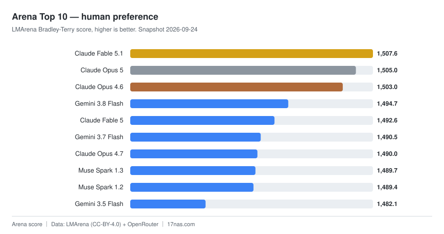
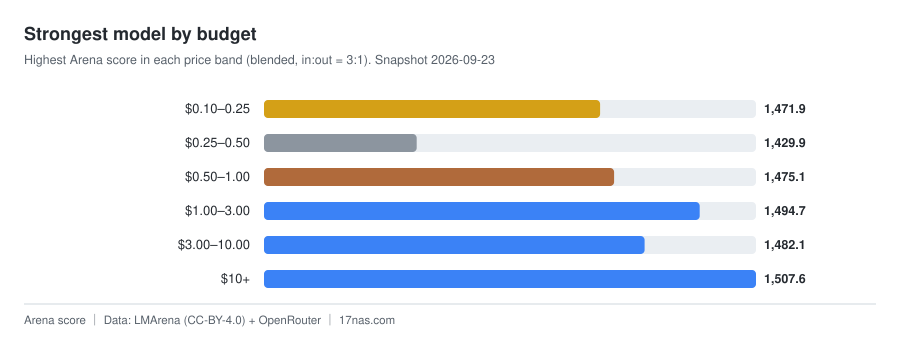

# 大模型排行榜 · LLM Leaderboard · 模型能力与成本对比

> 📊 **每日自动更新**的大模型排行榜（LLM Leaderboard）：聚合 Arena 人类盲测偏好与 OpenRouter 定价，
>
> 数据源：[17nas.com](https://17nas.com/llm-leaderboard.php) ｜ 快照 **2026-09-21**

涵盖 **闭源商用模型**（GPT / Claude / Gemini / Grok / Qwen / GLM / Kimi …）与 **开源权重模型**
（Llama / DeepSeek / Qwen / GLM / Mistral / MiniMax …），可按能力、价格、预算档位与上下文长度对比。

---

## 快照概览

| 指标 | 值 |
|---|---:|
| 收录模型 | **58** |
| 有 Arena 评分 | 43 |
| 有定价数据 | 57 |
| 开源权重 | 18 |
| 覆盖厂商 | 15 |
| 数据源 | lmarena ok | openrouter ok |
| 最近更新 | 2026-09-21 |

厂商分布：OpenAI (10)、Anthropic (9)、Google (8)、Alibaba (5)、Z.AI (4)、Moonshot AI (4)

---

## 榜单索引（5 个维度的模型对比）

| 榜单 | 说明 | 完整榜 |
|---|---|---|
| **Overall** | Arena human preference | [查看](leaderboard/all.md) |
| **Pick by budget** | Strongest model in each price band | [查看](leaderboard/budget.md) |
| **Lowest price** | Blended price ascending | [查看](leaderboard/price.md) |
| **Long context** | Maximum context window | [查看](leaderboard/ctx.md) |
| **Open weights** | Open-weight models only | [查看](leaderboard/open.md) |

---

## 📈 榜单可视化

> 图表随主题自动切换明暗；由 `scripts/render_charts.py` 每日生成。

---

## 🏆 综合榜 Top 10：Arena 人类偏好评分的模型排名

| # | Model | Org | Arena | Votes |
|---:|:---|:---|---:|---:|
| 🥇 | Claude Fable 5.1 | Anthropic | 1,507.6 | 5,783 |
| 🥈 | Claude Opus 5 | Anthropic | 1,505.0 | 20,706 |
| 🥉 | Claude Opus 4.6 | Anthropic | 1,503.0 | 71,993 |
| 4 | Gemini 3.8 Flash | Google | 1,494.7 | 5,076 |
| 5 | Claude Fable 5 | Anthropic | 1,492.6 | 30,057 |
| 6 | Gemini 3.7 Flash | Google | 1,490.5 | 5,640 |
| 7 | Claude Opus 4.7 | Anthropic | 1,490.0 | 60,002 |
| 8 | Muse Spark 1.2 | Meta | 1,489.4 | 3,227 |
| 9 | Gemini 3.5 Flash | Google | 1,482.1 | 38,257 |
| 10 | Qwen3.8 Max | Alibaba | 1,480.6 | 16,670 |

[→ 完整综合榜](leaderboard/all.md)

## 💰 按预算选：每档价格里最强的模型

> 回答的是「我预算 $X/百万 token，该用哪个」。**Gap to #1** 是相对榜首丢掉的 Arena 分数。

| Budget | Strongest model | Org | Weights | Arena | Gap to #1 | Price |
|:---|:---|:---|:---|---:|---:|---:|
| $0.10–0.25 | GLM-5.3 Flash | Z.AI | open | 1,471.9 | 35.7 | $0.143 |
| $0.25–0.50 | GPT-5.6 Luna | OpenAI | closed | 1,429.9 | 77.7 | $0.450 |
| $0.50–1.00 | GLM-5.2 | Z.AI | open | 1,466.9 | 40.7 | $0.998 |
| $1.00–3.00 | Gemini 3.8 Flash | Google | closed | 1,494.7 | 12.9 | $1.50 |
| $3.00–10.00 | Gemini 3.5 Flash | Google | closed | 1,482.1 | 25.5 | $3.38 |
| $10+ | Claude Fable 5.1 | Anthropic | closed | 1,507.6 | — | $20.00 |

[→ 完整预算榜](leaderboard/budget.md)

## 📄 长上下文榜 Top 10：最大上下文窗口的模型

| # | Model | Org | Context | Arena | Blended |
|---:|:---|:---|---:|---:|---:|
| 🥇 | Grok 4.20 | xAI | 2.0M | - | $1.56 |
| 🥈 | GLM-5.3 | Z.AI | 1.3M | 1,475.1 | $1.40 |
| 🥉 | GLM-5.3 Flash | Z.AI | 1.3M | 1,471.9 | $0.143 |
| 4 | GPT-5.5 | OpenAI | 1.1M | 1,470.9 | $11.25 |
| 5 | GPT-5.4 | OpenAI | 1.1M | 1,469.6 | $5.62 |
| 6 | MiMo V2.5 Pro | Xiaomi | 1.1M | 1,464.7 | $0.544 |
| 7 | GPT-5.6 Sol | OpenAI | 1.1M | 1,455.0 | $4.00 |
| 8 | GPT-5.6 Terra | OpenAI | 1.1M | 1,446.2 | $4.50 |
| 9 | GPT-5.6 Luna | OpenAI | 1.1M | 1,429.9 | $0.450 |
| 10 | MiMo V2.5 | Xiaomi | 1.1M | 1,427.4 | $0.175 |

[→ 完整长上下文榜](leaderboard/ctx.md)

---

## 数据说明

- **Arena 分数**：LMArena 人类盲测的 Bradley-Terry 评分，附 95% 置信区间。两个模型的区间重叠时，名次差异不必过度解读。
- **票数**：参与投票的样本量。票数越高，分数越稳定。
- **价格**：OpenRouter 公开定价，单位美元 / 百万 token；混合价格按输入:输出 = 3:1 加权。
- **涨跌**：与上一份快照的名次对比。NEW = 新进榜。

## 常见问题

**这是什么榜单？** 一个每日自动更新的大模型排行榜，用 Arena 人类盲测偏好衡量模型能力，用 OpenRouter 公开定价衡量成本。

**排名依据什么？** 综合榜按 LMArena 的 Bradley-Terry 评分（人类盲测胜率推导）排序，并给出 95% 置信区间。

**为什么不做「性价比分数」？** 试过，但 Arena 分数跨距只有约 6%，而价格跨距高达数百倍，
两者相除会退化成价格榜（实测 86% 同序）。所以改为**按价格分档取最强者** —— 这更贴近真实决策。

**为什么两个模型分数接近时不宜直接比名次？** 因为评分带有置信区间。区间重叠时，名次差异可能只是采样波动。

**数据多久更新一次？** 每日一次，由 GitHub Actions 自动拉取并提交；历史快照保留在 [`data/history/`](data/history/)。

**可以商用或二次分发吗？** 生成代码为 MIT；Arena 数据为 CC-BY-4.0（需署名）；请勿再分发 Artificial Analysis 数据。

## 更新机制

本仓库由 GitHub Actions **每日自动更新**：拉取聚合数据 → 生成榜单 → 提交。
历史快照保存在 [`data/history/`](data/history/)，可用于回溯任意一天的榜单。

## 相关项目

| 项目 | 说明 |
|---|---|
| [llm-benchmark-leaderboard](https://github.com/AmigaMeow/llm-benchmark-leaderboard) | 自托管的排行榜程序（PHP + 无数据库依赖），可基于本仓库的数据自行部署 |
| [cpu-benchmark-leaderboard](https://github.com/AmigaMeow/cpu-benchmark-leaderboard) | 自托管的 CPU 性能天梯榜 |
| [17nas.com/llm-leaderboard.php](https://17nas.com/llm-leaderboard.php) | 在线版榜单（含更多维度与历史趋势） |

## 许可与数据条款

- 本仓库的**榜单生成代码**以 [MIT](LICENSE) 许可开放。
- **Arena 评分**来自 LMArena（CC-BY-4.0 数据集），**价格数据**来自 OpenRouter 公开 API。
- 本仓库**不包含** Artificial Analysis 的数据：其 Terms of Use 明确禁止再分发，故未纳入。
- 完整的条款核查记录（含条款原文引用）见 [docs/UPSTREAM-TOS.md](docs/UPSTREAM-TOS.md)。
- 原始榜单与更多维度：[17nas.com/llm-leaderboard.php](https://17nas.com/llm-leaderboard.php)

---

*本页由 `scripts/render_readme.py` 自动生成，请勿手工编辑。*
